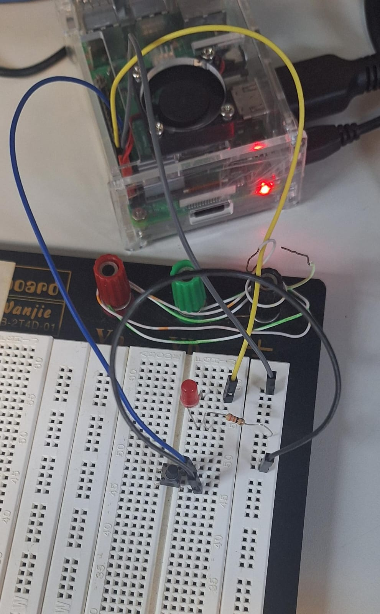
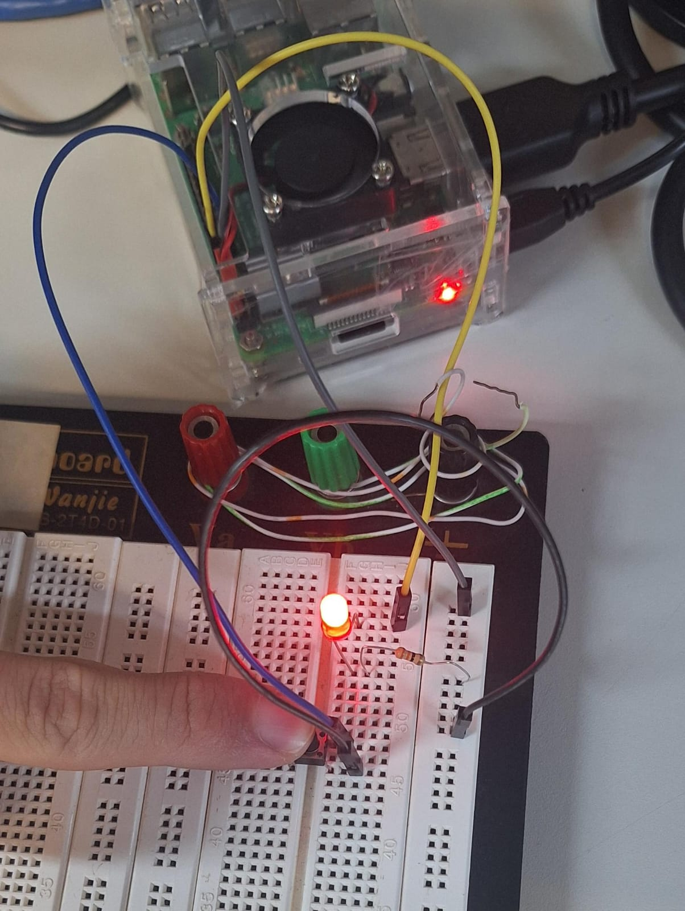

  
# SEL0337 - PROJETOS EM SISTEMAS EMBARCADOS
## Prática 5: Configuração do SystemD para Personalização de Serviços de Inicialização de S.O. em Linux Embarcado, Controle de Versão e Repositório de Códigos com Git e GitHub

### Aluno: Danilo Djovano Selli Junior Nº USP: 13836692
### Aluno: Lucas Nogueira Francklin Nº USP: 13677080

### Docente:	Prof. Pedro Oliveira

## Índice
- [Introdução](#Introdução)
    - [Funcionamento do Boot da Raspberry Pi](#Funcionamento-do-Boot-da-Raspberry-Pi)
    - [Systemd](#Systemd)
    - [Git e GitHub em Sistemas Embarcados](#Git-e-GitHub-em-Sistemas-Embarcados)
- [Parte 1](#Parte-1)
- [Parte 2](#Parte-2)

## Introdução
Esta prática tem como objetivo implementar uma unidade de serviço personalizada utilizando o systemd, com a finalidade de gerenciar a inicialização e execução de uma aplicação em sistemas embarcados com sistema operacional Linux. Esse processo permitirá a inicialização automática da aplicação durante o boot, eliminando a necessidade de intervenção manual.

O trabalho também contempla o uso do Git como sistema de controle de versão e do GitHub como repositório para documentação e rastreamento do histórico do projeto. Durante a prática, serão explorados conceitos fundamentais com foco na configuração de serviços personalizados em sistemas embarcados, como a Raspberry Pi.

Essa abordagem é especialmente relevante em aplicações comerciais embarcadas, que frequentemente demandam inicialização automática para garantir funcionalidade desde o momento em que o sistema é ligado. O trabalho, portanto, busca integrar teoria e prática no uso de tecnologias modernas para o desenvolvimento e gerenciamento de projetos embarcados.

### Funcionamento do Boot da Raspberry Pi

Primeiramente, para a aplicação do projeto da prática, vale dar destaque ao processo de boot da Raspberry Pi, que envolve múltiplos estágios, controlados por uma combinação de hardware, firmware e software, garantindo a inicialização eficiente do sistema operacional. Abaixo, segue um resumo do processo:

O processo de boot da Raspberry Pi é composto por múltiplos estágios, que envolvem a interação entre hardware, firmware e software. Ele garante a inicialização rápida e eficiente do sistema operacional Linux instalado no dispositivo.  

#### Resumo do Processo de Boot  

1. **Inicialização da GPU**  
   - Quando o dispositivo é ligado (*power on*), a GPU é inicializada usando um código gravado na ROM do SoC BCM.  
   - A CPU permanece inativa neste estágio.  

2. **Primeiro Estágio do Bootloader**  
   - A GPU busca o arquivo `bootcode.bin` na partição de boot do cartão microSD.  
   - Esse arquivo é responsável por carregar os componentes seguintes.  

3. **Segundo Estágio do Bootloader**  
   - Habilita a SDRAM e inicializa periféricos.  
   - Carrega o arquivo `start.elf`, que contém o firmware da GPU.  

4. **Terceiro Estágio do Bootloader**  
   - O firmware (`start.elf`) é carregado na RAM e executado pela GPU.  
   - A GPU busca o kernel Linux (`kernel.img`) e o carrega na RAM.  
   - A CPU ARM inicia a execução do kernel.  

5. **Init System**  
   - O kernel monta o sistema de arquivos root da segunda partição do cartão microSD.  
   - O **systemd** (ou outro *init system*) é iniciado, gerenciando o carregamento dos serviços necessários para a execução da distribuição Linux.  

Todo esse processo ocorre de forma extremamente rápida, em questão de segundos, permitindo que a Raspberry Pi esteja pronta para uso quase imediatamente após ser ligada.

### Systemd  

O **systemd** é um sistema de inicialização (*init system*) amplamente utilizado em distribuições Linux modernas para gerenciar o processo de boot e os serviços em execução no sistema. Ele foi projetado para substituir sistemas mais antigos, como o **SysVinit**, oferecendo maior eficiência, paralelismo e controle sobre os processos.  

#### Principais Funcionalidades  

- **Inicialização de Serviços**: Gerencia o início dos serviços necessários durante o boot.  
- **Gerenciamento de Serviços**: Permite iniciar, parar, reiniciar e monitorar serviços durante o funcionamento do sistema.  
- **Arquivos de Configuração**: Utiliza **unit files** para definir serviços, pontos de montagem, *sockets* e outros componentes do sistema.  
- **Controle com systemctl**: Ferramenta principal para interagir com o systemd, usada para gerenciar serviços e verificar o status do sistema.

O systemd é especialmente útil em sistemas embarcados e servidores devido à sua eficiência e flexibilidade. Ele modernizou a forma como os sistemas Linux são inicializados e gerenciados, tornando-o uma escolha padrão em várias distribuições.  

Para mais informações, consulte a [documentação oficial do systemd](https://freedesktop.org/wiki/Software/systemd/). 

### Git e GitHub em Sistemas Embarcados  

O uso do **Git** como sistema de controle de versão e do **GitHub** como repositório online é essencial para projetos profissionais, tanto em empresas quanto em comunidades de software livre. Esses recursos oferecem ferramentas poderosas para a gestão de código e documentação, especialmente em projetos colaborativos. 

Neste projeto, utilizaremos o **Git** como ferramenta principal para controle de versão e documentação, e o **GitHub** como repositório para armazenar e compartilhar o projeto.  

#### Benefícios do Git e GitHub  

1. **Controle de Versão**  
   - O Git gerencia alterações no código de forma eficiente, permitindo reverter versões, comparar mudanças e manter o histórico completo do projeto.  

2. **Documentação Centralizada**  
   - O repositório no GitHub servirá como referência para o projeto, facilitando a consulta, manutenção e replicação por outros desenvolvedores.  

3. **Colaboração em Equipe**  
   - O Git organiza contribuições e evita conflitos ao integrar mudanças feitas simultaneamente, tornando o desenvolvimento mais eficiente.  

4. **Distribuição e Acessibilidade**  
   - O GitHub oferece uma plataforma para armazenar e compartilhar o projeto, garantindo que ele seja facilmente acessado e implementado por outros interessados.  

#### Aplicação do Git no Projeto 

O Git será utilizado para rastrear todas as alterações realizadas no código e nos arquivos do projeto, garantindo organização e segurança no desenvolvimento. O uso combinado do Git e do GitHub permitirá documentar o projeto de forma eficiente, facilitando sua manutenção e expansão futura.  

Em projetos de sistemas embarcados, como este aplicado à Raspberry Pi, essas ferramentas são fundamentais para gerenciar a complexidade e permitir que o trabalho seja replicável, acessível e colaborativo.  

## Parte 1

|  |  |
| ------------------------------------------------------------ | ---------------------------------------------------------- |
| 
Botão Despressionado
                    | 
Botão Pressionado
                    |

Vídeo: [Assistir o vídeo](https://raw.githubusercontent.com/DaniloSelli/SEL0337/main/Docs/VideoInit.mp4)

## Parte 2
  

[Repositório git](https://github.com/DaniloSelli/SEL0337.git)
